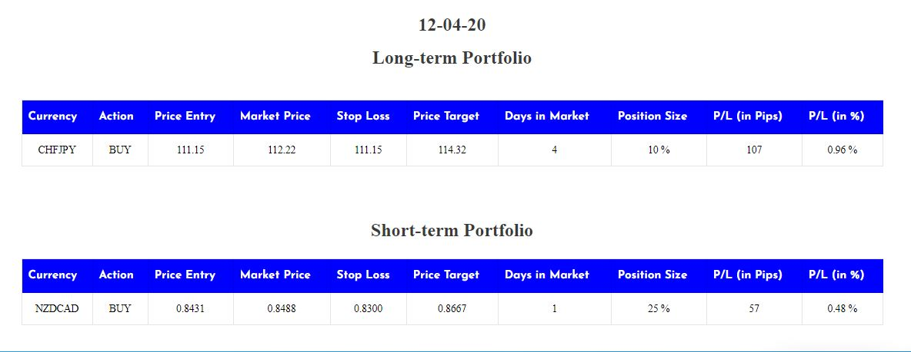
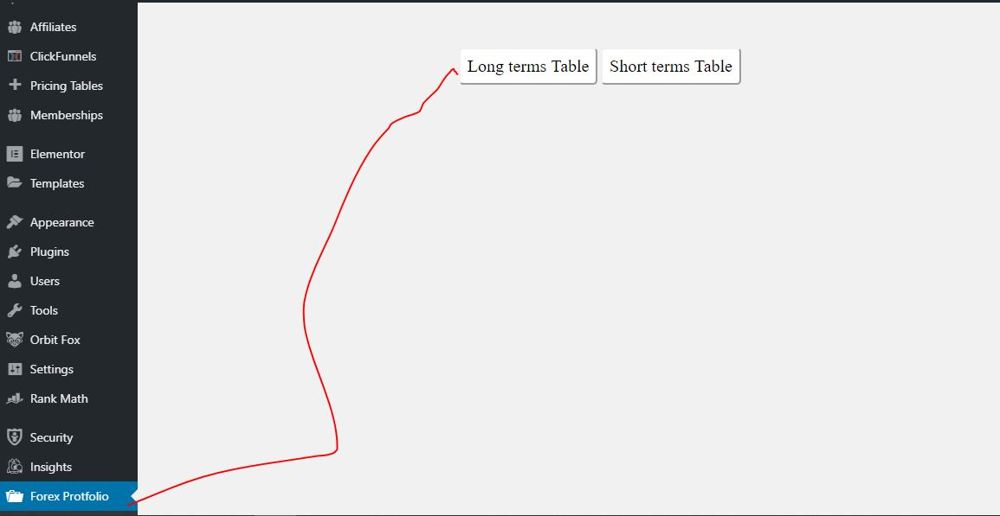

===== Fx Table ===

Plugin Name: FX Table
Plugin URI: https://www.upwork.com/fl/mdnazmul62
* Version:     1.0.0
Description: This plugin use to make forex exchange rate table with protfolio.
Author: Md Nazmul
text-domain: fx_table
Author URI: https://www.upwork.com/fl/mdnazmul62
License: GNU General Public License v3.0

==== Description===

This allow user to input forex table data manually and you will get auto exchange rate using API.

===Installation===:
 
Just download the zip file then go to wordpress Dashboard>>Plugins>Add new plugin>upload zip and activate.

===How to use==:

1. After install and activate the plugin you can see a admin menu called "Forex Protfolio".

2. In the settings page you can insert data unlimited to show into the table (no limit)

3. You can Insert ,update, Delete data using wordpress Admin and also exchnage rate will auto update using API

4. After insert data see above section where you can find a shortcode like "[fx-table-long]" and "[fx-table-short]" then just copy paste the shortcode 
anywhere in your pages or posts.

== Use shortcode==

"[fx-table-long]" and "[fx-table-short]"

I am using API from https://free.currencyconverterapi.com/ (Specially thanks to them)

If you have any question feel free to ask me >> Developer@deshonlineit.com

Thanks.

